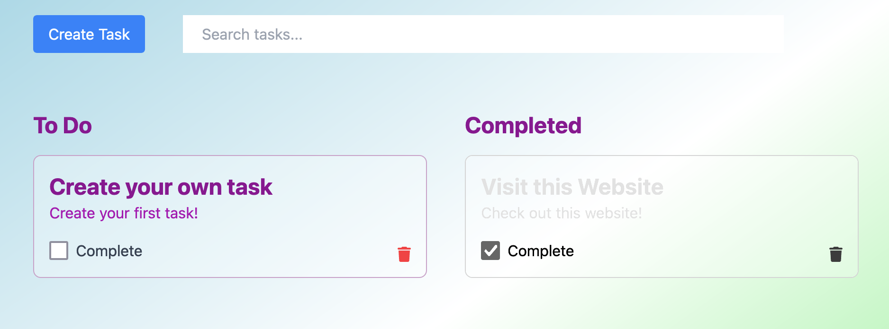

# Todo Application 🏋️‍♂️

Welcome to the Todo Application built with Next.js and React! 🌟 This project is part of my portfolio and showcases the power of modern web development using cutting-edge technologies. Before you dive into this application, make sure to check out the [Todo Express Backend](https://github.com/mdbudnick/todo-express) project, as it needs to be up and running for this frontend to function properly.

## Features 🌈

- **Next.js & React**: Leveraging the power of Next.js and React to create a seamless and efficient web application.
- **Modular Structure**: The application boasts a modular and legible structure for easy maintenance and scalability.
- **Typescript**: Built with Typescript for enhanced developer experience and code safety.
- **Automatic Model Sync**: Automatically syncs models with the backend repository through Github Action-generated Pull Requests. Keeping your models up-to-date has never been easier!
- **React component testing** to ensure the reliability and performance of the user interface.
- **Vercel Hosting**: Hosted on Vercel for a fast and reliable user experience. ([Non-functional wihout backend](https://todo-nextjs-theta-two.vercel.app))

## Functionality 🛠️

- **View Tasks**: Browse through your todo tasks effortlessly.
- **Create Task**: Add new tasks with ease, making your todo list complete!
- **Update Task**: Modify existing tasks to keep your information up-to-date.
- **Delete Task**: Remove tasks that are no longer needed.
- **Search Tasks**: Easily find tasks by utilizing the search functionality.

## Backend Integration 🔄

This application interacts with the Todo Express Backend, providing seamless persistence based on a sessionId stored in the cookie. This backend integration ensures a smooth user experience with data persistence.

## Getting Started 🚀

1. Clone the [Todo Express Backend](https://github.com/mdbudnick/todo-express) repository and follow the instructions to set it up.
2. Clone this repository.
3. Install dependencies by running `npm install`.
4. Run the application using `npm run dev`.
5. Open your browser and navigate to `http://localhost:3000` to see the magic!

## Contributing 🤝

Contributions are welcome! Feel free to open issues or pull requests to help improve this project. Let's make it even more awesome together! 🚀
